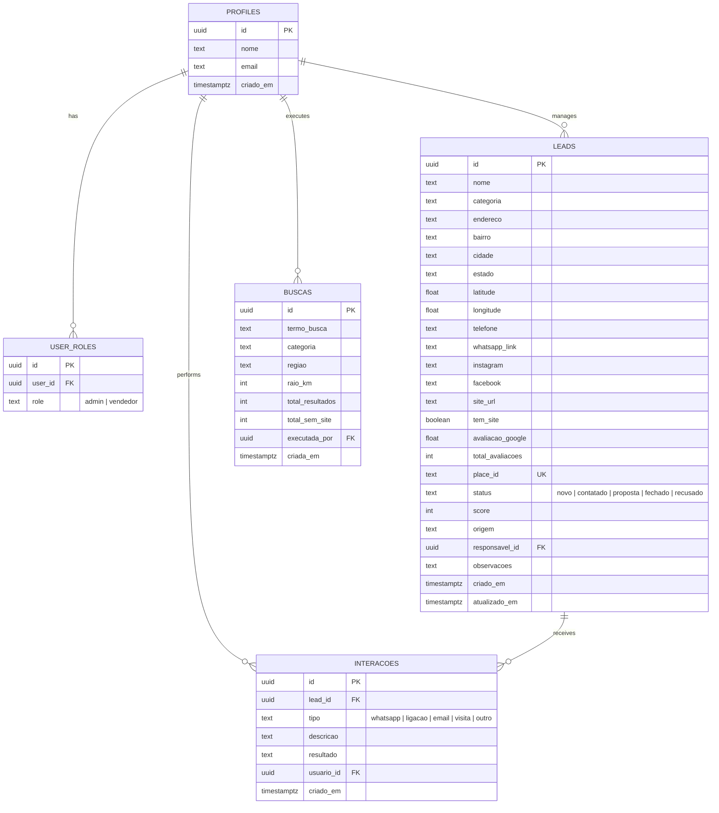

# 🧭 Prospecta Hub — Inteligência Comercial & Prospecção de Estabelecimentos

> **Plataforma SaaS de prospecção ativa e mineração cartográfica de empresas locais sem site próprio para abordagem comercial e conversão de serviços digitais.**

---

## 📌 Visão Geral do Sistema

O **Prospecta Hub** é uma plataforma comercial desenvolvida para equipes de vendas e agências digitais localizarem, analisarem, priorizarem e abordarem estabelecimentos comerciais locais (restaurantes, barbearias, oficinas, clínicas, petshops, lojas, etc.) que ainda **não possuem site próprio**.

O sistema combina varreduras georreferenciadas via **Google Places API**, um **algoritmo de score preditivo** ponderado, um **pipeline visual Kanban**, integração de abordagem via **WhatsApp (`wa.me`)** e um módulo robusto de **gestão de equipe com trilha de auditoria**.

---

## 🚀 Principais Módulos & Funcionalidades

### 1. 🔍 Varredura & Mineração Cartográfica (`/nova-busca`)

- **Detecção Georreferenciada**: Busca estabelecimentos por nicho/categoria comercial, cidade/bairro e raio delimitado em quilômetros.
- **Integração com Google Places API (New Text Search)**: Realizada de forma segura via Edge Function do Supabase ou integração direta.
- **Filtro Inteligente de Presença Web**: Identifica ausência de site e diferencia sites próprios de links de redes sociais (_Instagram, Facebook, TikTok, Linktree, wa.me_). Redes sociais são catalogadas para enriquecer o lead sem marcar falsamente como "empresa com site".
- **Modo de Contingência Contextual**: Sistema de fallback geográfico inteligente caso a cota da API seja excedida.
- **Importação Granular**: Tabela/grade de pré-visualização para seleção manual ou em massa dos estabelecimentos antes de persistir no banco.

---

### 2. 🎯 Algoritmo de Score de Prioridade Comercial (0 a 100)

Cada lead é pontuado automaticamente para indicar o potencial de fechamento:

- **Ausência de site próprio**: `+45 pontos` (principal oportunidade comercial).
- **Presença em redes sociais sem site**: `+15 pontos` (indica empresa ativa que já investe em marketing).
- **Volume de avaliações no Google**: Até `+20 pontos` (estabelecimentos com grande fluxo e clientes).
- **Nota média no Google**: Até `+15 pontos` (reputação consolidada).
- **Recência do cadastro**: `+5 pontos` (prioridade para abordagem rápida nos primeiros 7 dias).

**Classificação Visual:**

- 🔴 **Prioridade Alta** ($\ge 70$ pts)
- 🟡 **Prioridade Média** ($40 - 69$ pts)
- 🔵 **Prioridade Baixa** ($< 40$ pts)

---

### 3. 📊 Dashboard Executivo & Métricas (`/painel`)

- **Cards de Indicadores (KPIs)**: Total de estabelecimentos cadastrados, total e percentual sem site, score médio da base e taxa de conversão em contratos fechados.
- **Gráficos Analíticos com Recharts**:
  - _Oportunidades por Segmento_: Gráfico de barras comparando oportunidades sem site vs. total por nicho.
  - _Status do Funil_: Distribuição percentual dos leads em cada estágio de negociação.
- **Leads Mais Quentes**: Destaque rápido das oportunidades de maior pontuação aguardando primeiro contato.
- **Últimos Estabelecimentos**: Tabela de recência com botão de ação direta.

---

### 4. 🔄 Funil de Vendas Kanban em Tempo Real (`/funil`)

- **Pipeline Visual em 5 Estágios**:
  1. 🟦 `Novos` — Estabelecimentos recém-importados aguardando abordagem.
  2. 🟨 `Contatados` — Primeiro contato realizado via WhatsApp ou ligação.
  3. 🟪 `Proposta Enviada` — Proposta comercial apresentada ao tomador de decisão.
  4. 🟩 `Fechados (Ganhos)` — Contrato firmado com sucesso.
  5. 🟥 `Recusados` — Oportunidade declinada ou sem interesse no momento.
- **Drag & Drop Interativo**: Movimentação fluida de cards entre as colunas com atualização instantânea.
- **Sincronização em Tempo Real (Supabase Realtime)**: Atualizações de leads refletidas instantaneamente para todos os usuários conectados.
- **Ações Administrativas**: Ferramentas para reiniciar o funil ou zerar a base com segurança.

---

### 5. 📋 Gestão de Estabelecimentos & Ficha Comercial (`/leads` e `/leads/$id`)

- **Visão Alternável**: Modo **Tabela** detalhada ou modo **Grade** de cards visuais.
- **Filtros Avançados**: Busca textual instantânea, filtro por categoria, status, faixa de score e switch exclusivo _"Apenas sem site"_.
- **Ordenação Dinâmica**: Por score de prioridade, avaliação Google ou data de cadastro.
- **Ficha Técnica Detalhada do Lead (`/leads/$id`)**:
  - Dados cadastrais completos: endereço, bairro, cidade, estado, telefone, Instagram, Facebook.
  - Avaliação e total de avaliações no Google Maps.
  - Bloco de anotações e observações comerciais persistentes.
  - **Linha do Tempo de Interações**: Histórico de abordagens (WhatsApp, Ligação, E-mail, Visita presencial) com registro de data, responsável e resultados.

---

### 6. 💬 Abordagem Comercial via WhatsApp (`wa.me`)

- **Geração Dinâmica de Mensagens**: Templates persuasivos contextualizados com o nome da empresa, nicho e localização.
- **Abertura em 1 Clique**: Gera o link `https://wa.me/55...` direto para o WhatsApp Web ou aplicativo móvel.
- **Automação de Fluxo**: Ao disparar a conversa, o lead é automaticamente promovido para o status `Contatado` e uma nova entrada é adicionada na linha do tempo e no log de auditoria.

---

### 7. 👥 Gestão de Usuários, Controle de Acesso (RBAC) & Auditoria (`/usuarios`)

- **Papéis de Usuário**:
  - **Administrador**: Gestão total da equipe, auditoria completa, visualização global de todos os leads e operações sensíveis.
  - **Vendedor / Consultor**: Operação focada no funil, abordagem e registro de interações.
- **Fluxo de Primeiro Acesso**: Administrador gera convites com senha inicial provisória; no primeiro acesso, o usuário é obrigado a definir sua senha pessoal definitiva.
- **Trilha de Auditoria Completa**: Registro cronológico de todas as ações relevantes (logins, abordagens de WhatsApp, transições de funil, criações de usuários e minerações de leads).

---

### 8. 📜 Histórico de Varreduras (`/buscas`)

- Histórico completo de pesquisas executadas no Google Places com registro de termo, região mapeada, raio de busca, volume de resultados encontrados e percentual sem site.
- Opção de **re-executar varreduras** para identificar novos negócios abertos recentemente.

---

## 🛠️ Stack Tecnológica

| Camada                       | Tecnologia                                                                                    | Descrição                                                                           |
| :--------------------------- | :-------------------------------------------------------------------------------------------- | :---------------------------------------------------------------------------------- |
| **Frontend**                 | [React 19](https://react.dev/) + [TypeScript](https://www.typescriptlang.org/)                | Interface moderna, tipada e com alta performance                                    |
| **Framework & SSR**          | [TanStack Start](https://tanstack.com/start) + [TanStack Router](https://tanstack.com/router) | Renderização híbrida SSR/SPA com roteamento baseado em arquivos                     |
| **Estilização**              | [Tailwind CSS v4](https://tailwindcss.com/)                                                   | Estilização utilitária com design system escuro cartográfico                        |
| **Componentes UI**           | [Radix UI](https://www.radix-ui.com/) + [Lucide Icons](https://lucide.dev/)                   | Componentes acessíveis, modais, dropdowns e ícones                                  |
| **Visualização de Dados**    | [Recharts](https://recharts.org/)                                                             | Gráficos responsivos de barras, funis e indicadores                                 |
| **Backend & Banco de Dados** | [Supabase](https://supabase.com/)                                                             | PostgreSQL, Autenticação JWT, Row Level Security (RLS) e Realtime                   |
| **Serverless Functions**     | [Supabase Edge Functions](https://supabase.com/docs/guides/functions) (Deno)                  | Execução segura da API do Google Places no backend                                  |
| **Resiliência & Fallback**   | LocalStorage Sync Layer                                                                       | Camada de persistência local que permite funcionamento híbrido e tolerante a falhas |

---

## 🗄️ Modelo de Dados (Supabase PostgreSQL)



---

## 📁 Estrutura de Diretórios

```plaintext
prospector-hub/
├── public/                     # Assets estáticos e ícones
├── src/
│   ├── components/
│   │   ├── prospecta/          # Componentes específicos de negócio
│   │   │   ├── AppShell.tsx               # Layout mestre com Sidebar e Topbar
│   │   │   ├── BadgePrioridade.tsx        # Indicador visual de score comercial
│   │   │   ├── BadgeStatus.tsx            # Badge de estágio no funil
│   │   │   └── ModalMensagemWhatsApp.tsx  # Modal de envio customizado de WhatsApp
│   │   └── ui/                 # Componentes genéricos de UI (Design System)
│   ├── hooks/                  # Custom React Hooks (useAuth, use-mobile, etc.)
│   ├── integrations/supabase/  # Clientes Supabase (Client, Server, Auth Middleware)
│   ├── lib/                    # Regras de negócio, serviços e utilitários
│   │   ├── auditoria-service.ts  # Registro e feed de auditoria de ações
│   │   ├── geo-brasil.ts         # Base geográfica de cidades e coordenadas BR
│   │   ├── prospecta-service.ts  # CRUD de leads, buscas e interações
│   │   ├── score.ts              # Algoritmo de cálculo de score de prioridade
│   │   ├── usuarios-service.ts   # Gestão de equipe e convites
│   │   └── whatsapp.ts           # Formatador de links e gerador de mensagens
│   ├── routes/                 # Rotas baseadas em arquivos (TanStack Router)
│   │   ├── __root.tsx            # Layout raiz e provedores globais
│   │   ├── index.tsx             # Redirecionamento inicial
│   │   ├── auth.tsx              # Tela de Login, Cadastro e 1º Acesso
│   │   └── _authenticated/       # Grupo de rotas protegidas por autenticação
│   │       ├── painel.tsx        # Dashboard executivo principal
│   │       ├── nova-busca.tsx    # Scanner cartográfico Google Places
│   │       ├── funil.tsx         # Pipeline visual Kanban
│   │       ├── leads.tsx         # Lista e grade completa de leads
│   │       ├── leads.$id.tsx     # Ficha técnica detalhada do lead
│   │       ├── buscas.tsx        # Histórico de varreduras
│   │       └── usuarios.tsx      # Gestão de equipe e auditoria
│   ├── styles.css              # Configuração global do Tailwind CSS v4
│   ├── router.tsx              # Configuração do TanStack Router
│   ├── server.ts               # Ponto de entrada do servidor SSR
│   └── start.ts                # Inicialização do TanStack Start
├── supabase/
│   ├── config.toml             # Configuração do projeto Supabase
│   ├── functions/              # Edge Functions em Deno
│   │   └── buscar-places/      # Integração segura com Google Places API
│   └── migrations/             # Migrações SQL e scripts de estrutura
├── .env.example                # Modelo de variáveis de ambiente
├── package.json                # Dependências e scripts do projeto
├── tsconfig.json               # Configuração do TypeScript
└── vite.config.ts              # Configuração do Vite e plugins
```

---

## ⚙️ Variáveis de Ambiente (`.env`)

Para executar o projeto localmente, crie um arquivo `.env` na raiz do projeto com base no modelo abaixo:

```env
# Configurações do Supabase (Backend & Auth)
SUPABASE_PROJECT_ID="seu-project-id"
SUPABASE_PUBLISHABLE_KEY="sua-chave-publica-sb_publishable_..."
SUPABASE_URL="https://seu-project-id.supabase.co"

# Configurações para o Frontend (Vite)
VITE_SUPABASE_PROJECT_ID="seu-project-id"
VITE_SUPABASE_PUBLISHABLE_KEY="sua-chave-publica-sb_publishable_..."
VITE_SUPABASE_URL="https://seu-project-id.supabase.co"

# Chave da API Google Places / Maps (para busca e geolocalização)
GOOGLE_PLACES_API_KEY="sua-chave-google-places"
GOOGLE_MAPS_API_KEY="sua-chave-google-maps"
VITE_GOOGLE_MAPS_API_KEY="sua-chave-google-maps"
VITE_GOOGLE_PLACES_API_KEY="sua-chave-google-places"
```

---

## 🚀 Como Executar o Projeto

### Pré-requisitos

- [Node.js](https://nodejs.org/) versão 18 ou superior.
- Gerenciador de pacotes `npm` ou `bun`.

### Passo a Passo

1. **Clonar o Repositório**:

   ```bash
   git clone https://github.com/RayanSantsz/prospector-hub.git
   cd prospector-hub
   ```

2. **Instalar Dependências**:

   ```bash
   npm install
   ```

3. **Configurar as Variáveis de Ambiente**:

   ```bash
   cp .env.example .env
   # Preencha suas credenciais no arquivo .env
   ```

4. **Iniciar o Servidor de Desenvolvimento**:

   ```bash
   npm run dev
   ```

   Acesse a aplicação em `http://localhost:8080`.

5. **Outros Scripts Disponíveis**:
   ```bash
   # Validação de tipos TypeScript
   npx tsc --noEmit

   # Verificação de padrões e linting
   npm run lint

   # Formatação automática de código
   npm run format

   # Build de produção (Client + SSR + Nitro)
   npm run build

   # Pré-visualização do build de produção
   npm run preview
   ```

---

## 🎨 Identidade Visual & Design System

A interface do **Prospecta Hub** foi concebida com um tema escuro de alto contraste inspirado em **cartografia de precisão e interfaces operacionais**:

- **Fundo Principal**: `#11171A`
- **Superfícies e Cards**: `#1A2226` e `#212B30`
- **Bordas e Linhas de Grade**: `#2B363B`
- **Destaque Primário / Sem Site (Alerta)**: Laranja vibrante `#FF6B35`
- **Sucesso / Fechamento**: Verde-esmeralda `#3ECF8E`
- **Novos Leads**: Azul-elétrico `#5B8CFF`
- **Tipografia**: _Space Grotesk_ (Títulos e Display), _Inter_ (Corpo do texto) e _IBM Plex Mono_ (Scores, Telefones e Coordenadas).

---

## 🔒 Segurança e Boas Práticas

- **Row Level Security (RLS)**: Tabelas protegidas no PostgreSQL com políticas por papel e usuário.
- **Proteção de Rotas**: `_authenticated/route.tsx` valida a sessão de forma assíncrona antes de liberar o carregamento dos componentes.
- **Isolamento de Credenciais**: Chaves sensíveis são mantidas em variáveis de ambiente e não são commitadas no repositório.
- **Tratamento Resiliente**: Fallback dinâmico para garantir que instabilidades temporárias de conexão externa não interrompam o fluxo comercial da equipe.

---

## 📄 Licença

Projeto desenvolvido e mantido para prospecção comercial ativa. Todos os direitos reservados.
