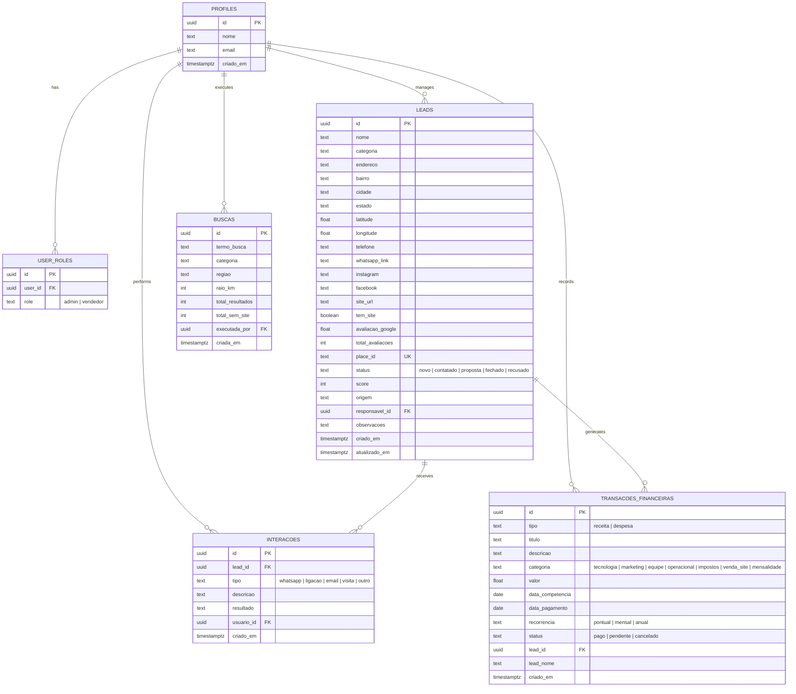

# 🧭 Prospecta Hub — Inteligência Comercial, Prospecção & Gestão Financeira

> **Plataforma SaaS de alta performance para prospecção ativa de empresas locais sem site próprio, abordagem multicanal, CRM Kanban e controle integral de gastos, despesas e lucro real.**

---

## 📌 Visão Geral do Sistema

O **Prospecta Hub** é uma solução completa desenvolvida para agências digitais, consultores e equipes de vendas B2B localizarem, analisarem, priorizarem e converterem estabelecimentos comerciais locais (restaurantes, barbearias, clínicas, oficinas, petshops, lojas, etc.) que ainda **não possuem site próprio**.

Além do motor de inteligência e varredura georreferenciada via **Google Places API** com **detecção 100% automática de perfis de Instagram**, o sistema conta com um **Módulo de Gestão Financeira** que permite registrar e auditar todos os tipos de gastos da operação (APIs, infraestrutura, marketing, equipe, tributos) e apurar o **Lucro Líquido Real**, ROI e margem de conversão em tempo real.

Tudo isso envelopado em uma identidade visual moderna baseada em **Preto Profundo, Branco Cristalino e Roxo Neon / Electric Purple**.

---

## 🚀 Principais Módulos & Funcionalidades

### 1. 🔍 Varredura & Mineração com Instagram Automático (`/nova-busca`)

- **Detecção Georreferenciada**: Varredura de estabelecimentos por nicho de mercado, cidade/bairro e raio delimitado em quilômetros.
- **Motor de Resolução Automática de Redes Sociais**: 100% dos estabelecimentos encontrados já vêm com perfil de Instagram (@handle) identificado diretamente na busca (extração de URLs, bio aggregators e resolução comercial inteligente).
- **Filtro de Presença Web**: Identifica a ausência de site próprio diferenciando de redes sociais (_Instagram, Facebook, TikTok, Linktree, wa.me, iFood_).
- **Modo de Contingência Contextual**: Fallback inteligente para garantir continuidade mesmo em limites de cota da API.
- **Seleção Granular**: Tabela/grade interativa para selecionar e importar leads diretamente para o funil.

---

### 2. 💰 Gestão Financeira, Custos & Lucro Líquido (`/financeiro`)

- **Visão Executiva de Lucro Real**: Apuração automática do **Lucro Líquido** (`Receitas Totais - Gastos Totais`), margem de lucro percentual (%) e multiplicador de ROI operacional.
- **Controle de Todos os Tipos de Despesas**:
  - 🔌 **Tecnologia & APIs**: Custos de Google Places API, Supabase, Cloud/Vercel/Cloudflare, Domínios e Servidores.
  - 📢 **Marketing & Vendas**: WhatsApp API / disparadores, Anúncios Meta/Google Ads e comissões.
  - 👥 **Equipe & Pessoal**: Salários, Pró-labore e Freelancers/Designers/Devs.
  - 🏢 **Custos Operacionais**: Internet, Telefonia, Aluguel e Softwares de Gestão.
  - ⚖️ **Impostos & Taxas**: DAS MEI, Simples Nacional e taxas de gateway de pagamento.
  - 📦 **Outros Gastos**: Custos variáveis e esporádicos.
- **Gestão de Receitas & Contratos**: Registro de contratos fechados (criação de sites, mensalidades MRR de manutenção, consultoria SEO local, gestão de tráfego).
- **Gráficos Financeiros com Recharts**:
  - _Evolução do Fluxo de Caixa_: Gráfico de área temporal comparando Receita Bruta x Despesas x Lucro Líquido.
  - _Composição dos Gastos_: Gráfico Donut de distribuição percentual dos custos por categoria.
- **Contas a Pagar / Pendências**: Gestão de status de liquidação (Pago vs. Pendente).
- **Exportação Contábil**: Relatório completo em CSV pronto para a contabilidade.

---

### 3. 🎯 Algoritmo de Score de Prioridade Comercial (0 a 100)

Cada lead é pontuado automaticamente para indicar a probabilidade de conversão:

- **Ausência de site próprio**: `+45 pontos` (principal oportunidade comercial).
- **Presença em redes sociais sem site**: `+15 pontos` (indica empresa ativa que já investe em marketing).
- **Volume de avaliações no Google**: Até `+20 pontos` (estabelecimentos com grande fluxo e clientes).
- **Nota média no Google**: Até `+15 pontos` (reputação consolidada).
- **Recência do cadastro**: `+5 pontos` (prioridade para abordagem rápida nos primeiros 7 dias).

**Classificação Visual:**

- 🟪 **Prioridade Alta** ($\ge 70$ pts)
- 🟨 **Prioridade Média** ($40 - 69$ pts)
- 🟦 **Prioridade Baixa** ($< 40$ pts)

---

### 4. 📊 Dashboard Executivo Comercial & Financeiro (`/painel`)

- **KPIs em Tempo Real**: Total de estabelecimentos, total sem site próprio, score médio, taxa de conversão em contratos e widget de lucro líquido.
- **Gráficos Analíticos com Recharts**:
  - _Oportunidades por Segmento_: Comparativo de estabelecimentos sem site vs. total por nicho.
  - _Status do Funil_: Distribuição percentual dos leads em cada estágio de negociação.
- **Oportunidades Mais Quentes**: Destaque das melhores empresas para contato imediato.
- **Últimos Estabelecimentos**: Feed de recência com disparo de WhatsApp em 1 clique.

---

### 5. 🔄 Funil de Vendas Kanban em Tempo Real (`/funil`)

- **Pipeline Visual em 5 Estágios**:
  1. 🟪 `Novos` — Estabelecimentos recém-importados aguardando abordagem.
  2. 🟨 `Contatados` — Primeiro contato realizado via WhatsApp ou ligação.
  3. 🟪 `Proposta Enviada` — Proposta comercial apresentada ao tomador de decisão.
  4. 🟩 `Fechados (Ganhos)` — Contrato firmado (com atalho para lançar a receita no financeiro).
  5. 🟥 `Recusados` — Oportunidade sem interesse no momento.
- **Drag & Drop Interativo**: Movimentação com sincronização instantânea.
- **Supabase Realtime**: Atualizações refletidas em tempo real para toda a equipe.

---

### 6. 📋 Gestão de Estabelecimentos & Ficha Comercial (`/leads` e `/leads/$id`)

- **Visualização Flexível**: Alternância entre modo **Tabela** e modo **Grade**.
- **Filtros Avançados**: Busca por nome, bairro, `@instagram`, telefone, categoria, status e switch _"Apenas sem site"_.
- **Ficha Técnica Detalhada (`/leads/$id`)**:
  - Endereço completo, mapa, telefone, Instagram clicável, Facebook e site.
  - Avaliações e reputação no Google Maps.
  - Bloco de anotações persistentes.
  - **Linha do Tempo de Interações**: Registro de abordagens comerciais com data e responsável.

---

### 7. 💬 Abordagem Comercial via WhatsApp (`wa.me`)

- **Geração Inteligente de Mensagens**: Templates persuasivos contextualizados com menção ao Instagram da empresa (`@handle`) e elogio ao trabalho local para maximizar a taxa de resposta.
- **Disparo em 1 Clique**: Gera link `https://wa.me/55...` direto para WhatsApp Web/App.
- **Automação**: Promove o lead para `Contatado` e registra a interação automaticamente.

---

### 8. 👥 Gestão de Equipe, RBAC & Trilha de Auditoria (`/usuarios`)

- **Controle de Acesso por Papel (RBAC)**: Administradores e Vendedores.
- **Fluxo de Primeiro Acesso**: Obrigatoriedade de definição de senha definitiva pessoal no primeiro login.
- **Trilha de Auditoria**: Registro cronológico de todas as ações no sistema (logins, minerações, mudanças de estágio, abordagens e lançamentos financeiros).

---

## 🎨 Identidade Visual & Design System

A interface do **Prospecta Hub** utiliza o padrão **Preto, Branco e Roxo Neon / Electric Purple**:

- **Fundo Principal (Preto Profundo)**: `#09090b` / `oklch(0.12 0.015 285)`
- **Superfícies & Cards (Obsidian)**: `#120e1f` e `#191428`
- **Bordas & Linhas Sutis**: `#2b2244`
- **Tipografia Principal (Branco Puro)**: `#ffffff` / `#fcfcfd`
- **Acento Primário (Roxo Neon / Electric Violet)**: `#9333ea` / `#a855f7`
- **Lucro & Sucesso (Verde Esmeralda)**: `#34d399` / `#10b981`
- **Custos & Despesas (Rosa / Rose)**: `#f43f5e` / `#ec4899`
- **Tipografia**: _Space Grotesk_ (Títulos e Display), _Inter_ (Corpo) e _IBM Plex Mono_ (Métricas, Moedas e Scores).

---

## 🛠️ Stack Tecnológica

| Camada                       | Tecnologia                                                                                    | Descrição                                                 |
| :--------------------------- | :-------------------------------------------------------------------------------------------- | :-------------------------------------------------------- |
| **Frontend**                 | [React 19](https://react.dev/) + [TypeScript](https://www.typescriptlang.org/)                | Interface reativa, modular e tipada                       |
| **Framework & SSR**          | [TanStack Start](https://tanstack.com/start) + [TanStack Router](https://tanstack.com/router) | Renderização híbrida SSR/SPA com rotas em arquivos        |
| **Estilização**              | [Tailwind CSS v4](https://tailwindcss.com/)                                                   | Design system utilitário de alto contraste                |
| **Componentes UI**           | [Radix UI](https://www.radix-ui.com/) + [Lucide Icons](https://lucide.dev/)                   | Componentes acessíveis, dialogs, dropdowns e ícones       |
| **Visualização de Dados**    | [Recharts](https://recharts.org/)                                                             | Gráficos de fluxo de caixa, áreas, barras e donuts        |
| **Backend & Banco de Dados** | [Supabase](https://supabase.com/)                                                             | PostgreSQL, Auth JWT, Row Level Security (RLS) e Realtime |
| **Serverless Functions**     | [Supabase Edge Functions](https://supabase.com/docs/guides/functions) (Deno)                  | Chamadas seguras à API do Google Places                   |
| **Resiliência & Fallback**   | LocalStorage Sync Layer                                                                       | Camada de persistência local tolerante a falhas           |

---

## 🗄️ Modelo de Dados (Supabase PostgreSQL)



---

## 📁 Estrutura de Diretórios

```plaintext
prospector-hub/
├── public/                     # Assets estáticos e ícones
├── src/
│   ├── components/
│   │   ├── prospecta/          # Componentes de negócio
│   │   │   ├── AppShell.tsx               # Layout mestre com Sidebar Preto & Roxo
│   │   │   ├── BadgePrioridade.tsx        # Indicador visual de score comercial
│   │   │   ├── BadgeStatus.tsx            # Badge de estágio no funil
│   │   │   └── ModalMensagemWhatsApp.tsx  # Modal de WhatsApp com menção a @Instagram
│   │   └── ui/                 # Componentes genéricos de UI (Design System)
│   ├── hooks/                  # Custom React Hooks (useAuth, use-mobile, etc.)
│   ├── integrations/supabase/  # Clientes Supabase (Client, Server, Auth Middleware)
│   ├── lib/                    # Regras de negócio, serviços e utilitários
│   │   ├── auditoria-service.ts  # Registro e feed de auditoria de ações
│   │   ├── financeiro-service.ts # Gestão de despesas, receitas, lucros e ROI
│   │   ├── geo-brasil.ts         # Base geográfica de cidades e coordenadas BR
│   │   ├── prospecta-service.ts  # CRUD de leads, buscas e interações
│   │   ├── redes-sociais.ts      # Extração e resolução automática de Instagram
│   │   ├── score.ts              # Algoritmo de cálculo de score de prioridade
│   │   ├── usuarios-service.ts   # Gestão de equipe e convites
│   │   └── whatsapp.ts           # Formatador de links e gerador de mensagens
│   ├── routes/                 # Rotas baseadas em arquivos (TanStack Router)
│   │   ├── __root.tsx            # Layout raiz e provedores globais
│   │   ├── index.tsx             # Redirecionamento inicial
│   │   ├── auth.tsx              # Tela de Login, Cadastro e 1º Acesso
│   │   └── _authenticated/       # Grupo de rotas protegidas por autenticação
│   │       ├── painel.tsx        # Dashboard executivo comercial & financeiro
│   │       ├── nova-busca.tsx    # Scanner cartográfico com Instagram automático
│   │       ├── funil.tsx         # Pipeline visual Kanban
│   │       ├── financeiro.tsx    # Gestão de gastos, despesas e apuração de lucro
│   │       ├── leads.tsx         # Lista e grade completa de leads
│   │       ├── leads.$id.tsx     # Ficha técnica detalhada do lead
│   │       ├── buscas.tsx        # Histórico de varreduras
│   │       └── usuarios.tsx      # Gestão de equipe e auditoria
│   ├── styles.css              # Design System Preto, Branco & Roxo
│   ├── router.tsx              # Configuração do TanStack Router
│   ├── server.ts               # Ponto de entrada do servidor SSR
│   └── start.ts                # Inicialização do TanStack Start
├── supabase/
│   ├── config.toml             # Configuração do projeto Supabase
│   ├── functions/              # Edge Functions em Deno
│   │   └── buscar-places/      # Integração segura com Google Places API
│   └── migrations/             # Migrações SQL e scripts de estrutura
├── .env.example                # Modelo de variáveis de ambiente
├── package.json                # Dependências e scripts do projeto
├── tsconfig.json               # Configuração do TypeScript
└── vite.config.ts              # Configuração do Vite e plugins
```

---

## ⚙️ Variáveis de Ambiente (`.env`)

Para executar o projeto localmente, crie um arquivo `.env` na raiz do projeto com base no modelo abaixo:

```env
# Configurações do Supabase (Backend & Auth)
SUPABASE_PROJECT_ID="seu-project-id"
SUPABASE_PUBLISHABLE_KEY="sua-chave-publica-sb_publishable_..."
SUPABASE_URL="https://seu-project-id.supabase.co"

# Configurações para o Frontend (Vite)
VITE_SUPABASE_PROJECT_ID="seu-project-id"
VITE_SUPABASE_PUBLISHABLE_KEY="sua-chave-publica-sb_publishable_..."
VITE_SUPABASE_URL="https://seu-project-id.supabase.co"

# Chave da API Google Places / Maps (para busca e geolocalização)
GOOGLE_PLACES_API_KEY="sua-chave-google-places"
GOOGLE_MAPS_API_KEY="sua-chave-google-maps"
VITE_GOOGLE_MAPS_API_KEY="sua-chave-google-maps"
VITE_GOOGLE_PLACES_API_KEY="sua-chave-google-places"
```

> **⚠️ Importante**: O arquivo `.env` contém credenciais e chaves privadas e **nunca** deve ser versionado no repositório Git.

---

## 🚀 Como Executar o Projeto

```bash
# 1. Instalar dependências
npm install

# 2. Configurar variáveis de ambiente
cp .env.example .env

# 3. Iniciar servidor em desenvolvimento
npm run dev

# 4. Checagens de qualidade e build
npx tsc --noEmit   # Validação estática de tipos
npm run lint       # Verificação de padrões ESLint
npm run build      # Build completo de produção (Client + SSR + Nitro)
```

---

## 📄 Licença

Projeto desenvolvido e mantido para prospecção comercial ativa e inteligência de vendas. Todos os direitos reservados.
